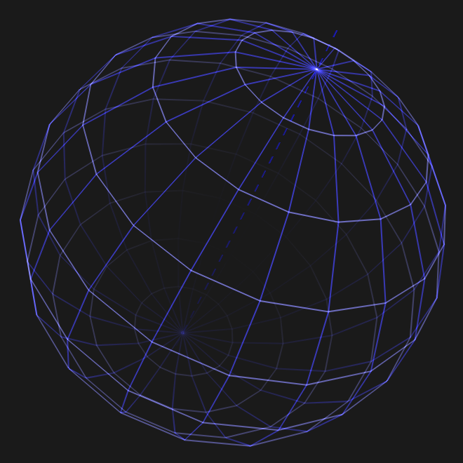

# Touch Stone
## About
OpenGL mouse manipulation test with Arcball class.

Arcball class made by **Terence J. Grant**: 
[Tatewake.com](https://tatewake.com/) / [Terence](https://tjgrant.com/wiki/)

## Controls
- Escape - exit application  
- Mouse - rotation of globe

## Screenshots
  
